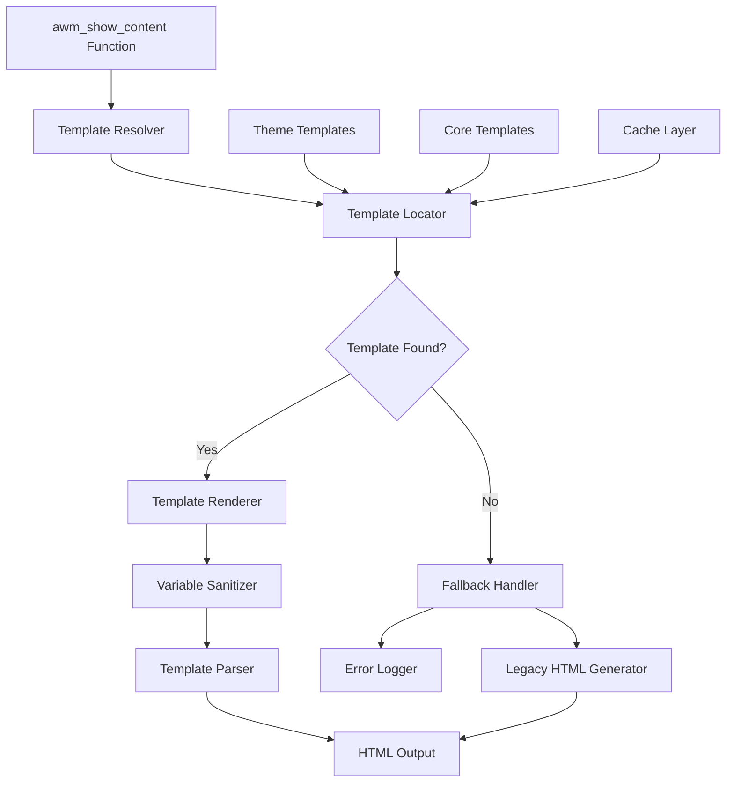
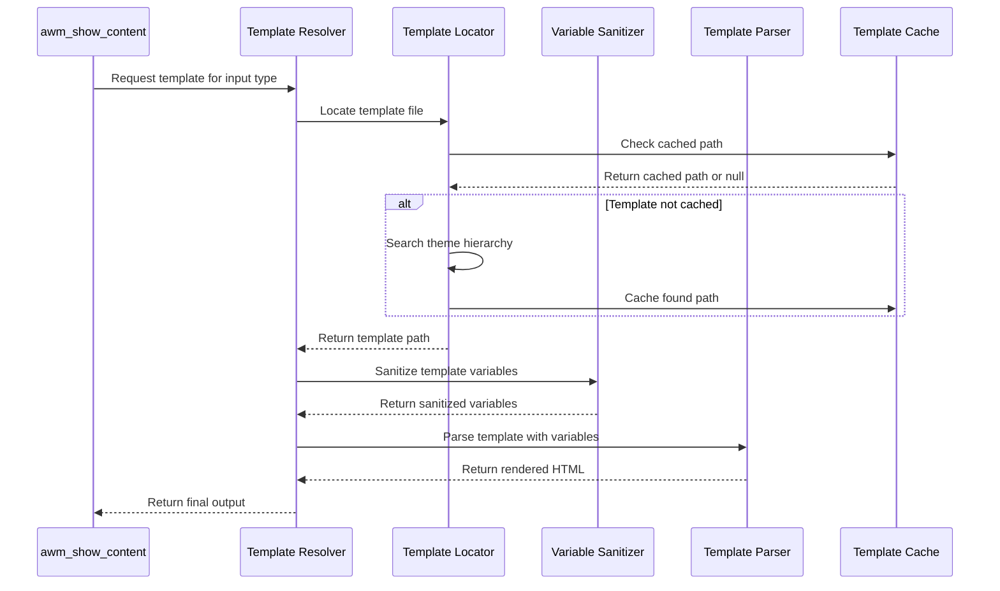

# Design Document: AWM Show Content Template Refactor

## Overview

This design outlines the refactoring of the `awm_show_content` function from inline HTML generation to a template-based rendering system. The current 800-line function generates HTML directly within PHP code, creating maintainability and customization challenges. The new system will separate presentation logic from business logic while maintaining full backward compatibility and adding Gutenberg block support.

The template system will leverage WordPress best practices for plugin template hierarchies, allowing theme developers to override templates while providing secure defaults and comprehensive error handling.

## Architecture

### High-Level Architecture



### Template Hierarchy

The system follows WordPress plugin template best practices with the following hierarchy:

1. **Child Theme Override**: `{child-theme}/extend-wp/templates/frontend/inputs/{template}.php`
2. **Parent Theme Override**: `{parent-theme}/extend-wp/templates/frontend/inputs/{template}.php`
3. **Core Plugin Template**: `{plugin}/templates/frontend/inputs/{template}.php`
4. **Fallback**: Legacy inline HTML generation

### Component Interaction



## Components and Interfaces

### 1. Template Resolver (`AWM_Template_Resolver`)

**Responsibility**: Main orchestrator for template-based rendering

**Interface**:
```php
class AWM_Template_Resolver {
    public function render_field($field_config, $value, $context): string
    public function get_template_path($input_type, $subtype = null): string
    public function set_fallback_mode($enabled): void
    public function clear_cache(): void
}
```

**Key Methods**:
- `render_field()`: Main entry point for template rendering
- `get_template_path()`: Resolves template file location
- `set_fallback_mode()`: Enables/disables legacy fallback
- `clear_cache()`: Clears template path cache

### 2. Template Locator (`AWM_Template_Locator`)

**Responsibility**: Locates template files following WordPress hierarchy

**Interface**:
```php
class AWM_Template_Locator {
    public function locate_template($template_name): string|false
    public function get_template_hierarchy($template_name): array
    public function is_template_overridden($template_name): bool
    public function get_template_version($template_path): string|null
}
```

**Template Search Order**:
1. Child theme: `{STYLESHEETPATH}/extend-wp/templates/frontend/inputs/{template}.php`
2. Parent theme: `{TEMPLATEPATH}/extend-wp/templates/frontend/inputs/{template}.php`
3. Plugin core: `{PLUGIN_PATH}/templates/frontend/inputs/{template}.php`

### 3. Variable Sanitizer (`AWM_Variable_Sanitizer`)

**Responsibility**: Sanitizes and escapes template variables for security

**Interface**:
```php
class AWM_Variable_Sanitizer {
    public function sanitize_variables($variables, $context): array
    public function escape_for_html($value): string
    public function escape_for_attribute($value): string
    public function validate_variable_types($variables, $schema): bool
}
```

**Security Features**:
- Automatic HTML entity escaping using `esc_html()`
- Attribute value escaping using `esc_attr()`
- URL escaping using `esc_url()`
- JavaScript escaping using `esc_js()`
- Configurable escaping contexts per variable

### 4. Template Parser (`AWM_Template_Parser`)

**Responsibility**: Processes template files with variables

**Interface**:
```php
class AWM_Template_Parser {
    public function parse_template($template_path, $variables): string
    public function set_template_data($data): self
    public function get_template_data(): array
    public function validate_template($template_path): bool
}
```

**Features**:
- Uses WordPress `load_template()` for consistency
- Supports global variable injection via `$wp_query->query_vars`
- Template validation and error handling
- Support for nested template includes

### 5. Template Cache (`AWM_Template_Cache`)

**Responsibility**: Caches template file paths and metadata

**Interface**:
```php
class AWM_Template_Cache {
    public function get_cached_path($template_name): string|false
    public function cache_path($template_name, $path): void
    public function invalidate_cache($template_name = null): void
    public function is_cache_valid($template_name): bool
}
```

**Caching Strategy**:
- File-based caching using WordPress transients
- Cache invalidation on theme switch
- Development mode bypass for template changes
- Cache warming for frequently used templates

## Data Models

### Field Configuration Schema

```php
interface FieldConfig {
    public string $case;           // Input type (input, select, textarea, etc.)
    public string $type;           // Input subtype (text, number, checkbox, etc.)
    public string $label;          // Field label
    public mixed $value;           // Field value
    public array $attributes;      // HTML attributes
    public array $options;         // Select/radio options
    public string $explanation;    // Help text
    public bool $required;         // Required field flag
    public array $class;           // CSS classes
    public string $render_type;    // Gutenberg render type
}
```

### Template Context Schema

```php
interface TemplateContext {
    public string $view;           // Context (post, term, user, widget)
    public string $target;         // Target (edit, display)
    public int|string $id;         // Entity ID
    public string $original_meta;  // Original meta key
    public bool $label;            // Show label flag
    public array $user_roles;      // Current user roles
}
```

### Template Variables Schema

```php
interface TemplateVariables {
    // Core variables available in all templates
    public FieldConfig $field;
    public TemplateContext $context;
    public mixed $value;
    public string $input_name;
    public string $input_id;
    public string $label_html;
    public string $explanation_html;
    public string $attributes_string;
    public array $css_classes;
    
    // Type-specific variables
    public array $options;         // For select/radio
    public array $gallery_images;  // For gallery
    public string $editor_content; // For wp_editor
}
```

## Template Structure

### Core Template Organization

```
templates/frontend/inputs/
├── input/
│   ├── text.php
│   ├── number.php
│   ├── checkbox.php
│   ├── hidden.php
│   ├── password.php
│   └── email.php
├── select.php
├── textarea.php
├── radio.php
├── section.php
├── awm_tab.php
├── map.php
├── repeater.php
├── image.php
├── awm_gallery.php
├── message.php
├── button.php
├── function.php
└── html.php
```

### Template File Structure

Each template follows this structure:

```php
<?php
/**
 * Template for {input_type} input
 * 
 * Available variables:
 * @var FieldConfig $field - Field configuration
 * @var TemplateContext $context - Rendering context
 * @var mixed $value - Field value
 * @var string $input_name - Input name attribute
 * @var string $input_id - Input ID attribute
 * @var string $label_html - Rendered label HTML
 * @var string $explanation_html - Rendered explanation HTML
 * @var string $attributes_string - HTML attributes string
 * @var array $css_classes - CSS classes array
 * 
 * @version 1.0.0
 */

if (!defined('ABSPATH')) {
    exit;
}

// Template-specific logic here
?>
<div class="<?php echo esc_attr(implode(' ', $css_classes)); ?>" 
     data-input="<?php echo esc_attr($input_id); ?>" 
     data-type="<?php echo esc_attr($field->case); ?>">
    
    <?php if (!empty($label_html)): ?>
        <?php echo $label_html; // Already escaped ?>
    <?php endif; ?>
    
    <?php if (!empty($explanation_html)): ?>
        <?php echo $explanation_html; // Already escaped ?>
    <?php endif; ?>
    
    <!-- Input-specific HTML here -->
    
</div>
```

### Variable Preparation

Before template rendering, variables are prepared and sanitized:

```php
class AWM_Template_Variable_Preparer {
    public function prepare_variables($field_config, $value, $context): array {
        return [
            'field' => $field_config,
            'context' => $context,
            'value' => $this->sanitize_value($value, $field_config),
            'input_name' => $this->generate_input_name($field_config, $context),
            'input_id' => $this->generate_input_id($field_config, $context),
            'label_html' => $this->render_label($field_config),
            'explanation_html' => $this->render_explanation($field_config),
            'attributes_string' => $this->render_attributes($field_config),
            'css_classes' => $this->prepare_css_classes($field_config, $context),
        ];
    }
}
```

## Correctness Properties

*A property is a characteristic or behavior that should hold true across all valid executions of a system—essentially, a formal statement about what the system should do. Properties serve as the bridge between human-readable specifications and machine-verifiable correctness guarantees.*

Now I need to use the prework tool to analyze the acceptance criteria before writing the correctness properties:

<function_calls>
<invoke name="prework">
<parameter name="featureName">awm-show-content-template-refactor

### Property Reflection

After analyzing all acceptance criteria, several properties can be consolidated to eliminate redundancy:

**Consolidations Made**:
- Properties about template file organization (1.1, 1.5, 6.1) can be combined into comprehensive template coverage
- Properties about variable passing (2.1, 2.2, 2.3) can be unified into complete variable availability
- Properties about theme overrides (3.1, 3.2, 3.3, 3.4) can be combined into template hierarchy behavior
- Properties about backward compatibility (4.1, 4.2, 4.3, 4.4, 4.5) can be unified into comprehensive compatibility
- Properties about error handling (7.1, 7.2, 7.3) can be combined into complete error handling behavior
- Properties about security (9.1, 9.2, 9.3, 9.4, 9.5) can be unified into comprehensive security behavior

### Core Correctness Properties

**Property 1: Template-Legacy Output Equivalence**
*For any* valid field configuration and context, the template-based rendering should produce HTML output identical to the legacy inline HTML generation
**Validates: Requirements 4.1**

**Property 2: Template Hierarchy Resolution**
*For any* template name, the template locator should check child theme, parent theme, and core plugin locations in that order, returning the first found template
**Validates: Requirements 3.1, 3.2, 3.3, 3.4**

**Property 3: Variable Sanitization Security**
*For any* template variables containing potentially dangerous content, all output should be properly escaped to prevent XSS attacks
**Validates: Requirements 2.5, 9.2, 9.3**

**Property 4: Template File Coverage**
*For any* input type handled by the legacy function, a corresponding template file should exist in the core plugin templates directory
**Validates: Requirements 1.5, 6.1**

**Property 5: Template Variable Availability**
*For any* template rendering, all required variables (field config, context, value, input attributes) should be available within the template scope
**Validates: Requirements 2.1, 2.2, 2.3**

**Property 6: Backward Compatibility Preservation**
*For any* existing function call to awm_show_content, the refactored function should accept the same parameters and maintain the same behavior
**Validates: Requirements 4.2, 4.3, 4.4, 4.5**

**Property 7: Template Cache Invalidation**
*For any* theme switch event, all cached template paths should be cleared and regenerated on next access
**Validates: Requirements 5.4**

**Property 8: Error Handling Graceful Degradation**
*For any* missing template file, the system should log an error and fall back to legacy HTML generation without breaking functionality
**Validates: Requirements 7.1, 7.2**

**Property 9: Gutenberg Block Compatibility**
*For any* field configuration used in both traditional forms and Gutenberg blocks, the template rendering should produce consistent output across both contexts
**Validates: Requirements 10.1, 10.2, 10.5**

**Property 10: Template Path Security**
*For any* template path resolution, the system should prevent directory traversal attacks and restrict template locations to approved directories
**Validates: Requirements 9.4**

**Property 11: Performance Optimization**
*For any* repeated template rendering of the same input type, template paths should be cached to avoid redundant filesystem operations
**Validates: Requirements 5.1, 5.2**

**Property 12: Input Type Specificity**
*For any* input subtype (text, checkbox, number, etc.), the system should use the most specific template available (e.g., input/text.php over input.php)
**Validates: Requirements 6.2**

## Error Handling

### Error Categories

1. **Template Not Found**
   - Log warning with template name and search paths
   - Fall back to legacy HTML generation
   - Continue execution without breaking

2. **Template Parse Error**
   - Log error with template path and PHP error details
   - Fall back to legacy HTML generation
   - Display debug information in development mode

3. **Variable Validation Error**
   - Log warning with invalid variable details
   - Use safe defaults for invalid variables
   - Continue template rendering

4. **Security Violation**
   - Log security warning with attempted path
   - Block template loading
   - Fall back to legacy generation

### Error Handling Implementation

```php
class AWM_Template_Error_Handler {
    public function handle_template_not_found($template_name, $search_paths): void {
        if (WP_DEBUG) {
            error_log(sprintf(
                'AWM Template not found: %s. Searched in: %s',
                $template_name,
                implode(', ', $search_paths)
            ));
        }
        
        do_action('awm_template_not_found', $template_name, $search_paths);
    }
    
    public function handle_template_parse_error($template_path, $error): void {
        error_log(sprintf(
            'AWM Template parse error in %s: %s',
            $template_path,
            $error->getMessage()
        ));
        
        if (WP_DEBUG) {
            wp_die(sprintf(
                'Template parse error in %s: %s',
                $template_path,
                $error->getMessage()
            ));
        }
        
        do_action('awm_template_parse_error', $template_path, $error);
    }
    
    public function handle_security_violation($attempted_path): void {
        error_log(sprintf(
            'AWM Template security violation: attempted to load %s',
            $attempted_path
        ));
        
        do_action('awm_template_security_violation', $attempted_path);
    }
}
```

### Development Mode Features

When `WP_DEBUG` is enabled:
- Detailed error messages with stack traces
- Template path resolution debugging
- Variable dump for template context
- Performance timing information
- Template version mismatch warnings

## Testing Strategy

### Dual Testing Approach

The testing strategy combines unit tests for specific functionality with property-based tests for comprehensive coverage:

**Unit Tests Focus**:
- Specific template rendering examples
- Error condition handling
- Integration between components
- Edge cases like empty values or malformed configurations

**Property-Based Tests Focus**:
- Universal properties across all input types
- Template hierarchy resolution with random paths
- Variable sanitization with generated malicious input
- Backward compatibility with random field configurations
- Performance characteristics under load

### Property-Based Testing Configuration

All property tests will use **QuickCheck for PHP** with minimum 100 iterations per test. Each test will be tagged with its corresponding design property:

**Example Property Test Structure**:
```php
/**
 * @test
 * Feature: awm-show-content-template-refactor, Property 1: Template-Legacy Output Equivalence
 */
public function test_template_legacy_output_equivalence() {
    $this->forAll(
        Generator::fieldConfiguration(),
        Generator::templateContext()
    )->then(function($fieldConfig, $context) {
        $legacyOutput = $this->legacyRenderer->render($fieldConfig, $context);
        $templateOutput = $this->templateRenderer->render($fieldConfig, $context);
        
        $this->assertEquals(
            $this->normalizeHtml($legacyOutput),
            $this->normalizeHtml($templateOutput)
        );
    });
}
```

### Test Coverage Requirements

- **100% coverage** of all input types and subtypes
- **Template hierarchy testing** with all theme configurations
- **Security testing** with malicious input generation
- **Performance benchmarking** comparing legacy vs template rendering
- **Gutenberg integration testing** with block rendering contexts
- **Error handling testing** with missing templates and invalid configurations

### Migration Testing

A special comparison mode will be implemented to validate the refactoring:

```php
class AWM_Template_Migration_Tester {
    public function compare_outputs($fieldConfig, $context): array {
        $legacyOutput = $this->renderWithLegacy($fieldConfig, $context);
        $templateOutput = $this->renderWithTemplate($fieldConfig, $context);
        
        return [
            'legacy' => $legacyOutput,
            'template' => $templateOutput,
            'identical' => $this->compareHtml($legacyOutput, $templateOutput),
            'differences' => $this->findDifferences($legacyOutput, $templateOutput)
        ];
    }
}
```

This migration tester will be used during development to ensure perfect compatibility and can be enabled in production for gradual rollout validation.